# Locomotion

The XR Interaction package provides a set of locomotion primitives that offer the means to move about a Scene during an XR experience. These components are:
- An XR Rig that represents the player
- A Locomotion System
- A Teleportation System
- A Snap Turn System

This documentation outlines how to use and extend these systems.

---

## Glossary

| **Term** | **Meaning** |
|-|-|
| **XR Rig** | MonoBehaviour that specifies a **Rig**, a **Camera Offset**, or a **Camera**. Also provides **Stationary** or **Room-Scale** options of tracking space to configure the XR Rig. |
| **Rig** | The base GameObject of the XR Rig. This is the GameObject that the application will manipulate via locomotion. By default, the Rig is the GameObject that the XR Rig is attached to.|
| **Camera Offset** | GameObject to move the Camera to the desired height off the floor. |
| **Camera** | GameObject that contains a Camera component. This is usually the main Camera that renders what the user sees, and is usually the 'head' of XR rigs. |
| **Room-Scale** | A floor-relative tracking mode. When the Scene starts, the origin is the floor. |
| **Stationary** | A device-relative tracking mode. When the Scene starts, the origin is the device, and the Camera moves to the height set by Camera Offset. |
| **Locomotion System** | MonoBehaviour that controls which Locomotion Provider can move the Rig. |
| **Locomotion Provider** | Base class for various locomotion implementations. |
| **Teleportation** | A type of locomotion that teleports the user from one position to another position. |
| **Snap Turn** | A type of locomotion that rotates the user by a fixed angle. |

## Set up a basic Scene for Teleportation and Snap Turn

### 1. Set up the XR Rig 

To set up an XR Rig, use one of the helper commands (**Room-Scale XR Rig** or **Stationary XR Rig**) from the **GameObject &gt; XR** menu. This creates an XR Rig GameObject in the Scene and sets the **Tracking Space** to **Room-Scale** or **Stationary**. It also creates an Interaction Manager, if there isn't one in the Scene. 

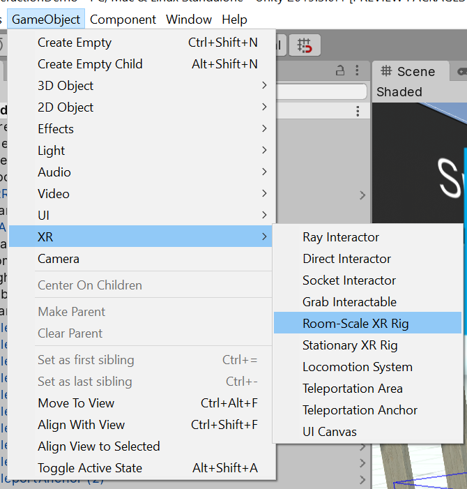

### 2. Add a Locomotion System with Teleportation and SnapTurn Providers

On the **XR Rig** GameObject, add a **Locomotion System**, a **Teleportation Provider**, and a **Snap Turn Provider**.

To set up Snap Turn, you need to use the **Snap Turn Provider** script. In the script, enable the primary device and (optionally) the secondary device, and set their **Device Node** and **Turn Input Source**. For a hand Controller with a joystick, the **Device Node** field should be **Left Hand** or **Right Hand**, and the **Turn Input Source** field should be **Primary 2D Axis**.

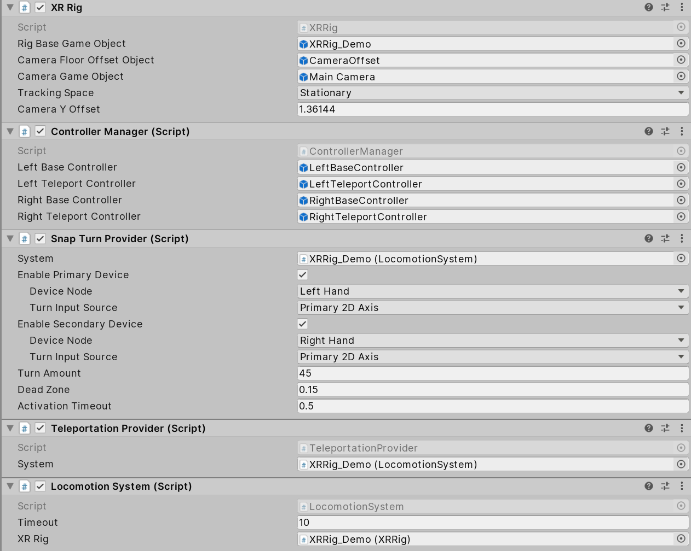

### 3. Create Teleportation Interactables

Create a **Plane** GameObject (from Unity's main menu, go to **GameObject &gt; 3D Object &gt; Plane**), then add a **Teleportation Area** script or a **Teleportation Anchor** script to the Plane GameObject.

If you followed steps 1-3, you should have a basic Scene with Teleportation and the Snap Turn System working, and be able to perform Teleportation and Snap Turn with your Controllers. The following steps offer additional configuration details for changing the appearance of the line of the **XR Ray Interactor**.

### 4. XR Ray Interactor line types

The **XR Ray Interactor** provides three default line types that can be used to select interactables in the Scene:

* **Straight Line**
* **Projectile Curve**
* **Bezier Curve**

These options are described below.

#### Straight Line

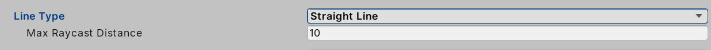

If you select the **Straight Line** option, the **XR Ray Interactor** performs a single raycast into the Scene with a ray length set by the **Max Raycast Distance** parameter. The image above shows the configuration options.

| **Straight line parameter** | **Description** |
|-|-|
| **Max Raycast Distance** | The distance to be raycast into the Scene. |

#### Projectile Curve

If you select the **Projectile Curve** option, the XR Ray Interactor samples the trajectory of a projectile to generate a projectile curve. You can use the angle of the Controller to control the distance of the landing point. When you lift your Controller, the landing point first goes further away, then comes closer if you keep lifting the Controller.

The **Projectile Curve** option is recommended for use in teleportation scenarios.

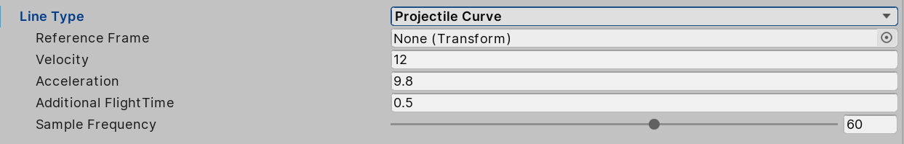

| **Projectile Curve parameter** | **Description** |
|-|-|
| **Reference Frame** | The reference frame of the projectile. If you don't set this, the XR Ray Interactor attempts to use the local XR Rig, which makes the curve always go up then down in the tracking space. If you set this to **None** or if the XR Rig doesn't exist, the curve rotates with the Controller. |
| **Velocity** | Initial velocity of the projectile. Increase this value to make the curve reach further. |
| **Acceleration** | Gravity of the projectile in the reference frame. |
| **Additional FlightTime** | Additional flight time after the projectile lands. Increase this value to make the endpoint drop lower in height. |
| **Sample Frequency** | The number of sample points of the curve. Higher numbers offer better better quality. |

#### Bezier Curve

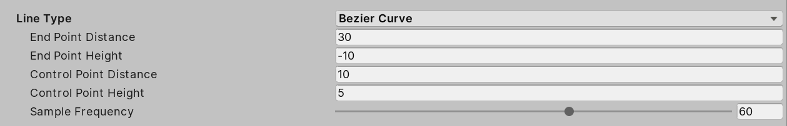

In addition to its start point, the **Bezier Curve** uses a control point and an end point. The start point is the position of the **Attached Transform** of the **Ray Interactor**. Unlike **Projectile Curve**, the **Bezier Curve** reference frame is set to itself by default. As a result, the curve rotates with the Controller.

| **Bezier curve parameter** | **Description** |
|-|-|
| **End Point Distance** | Define how far away the end point is from the start point. Increase the value to increase the distance. |
| **End Point Height** | Define how high the end point is in relation to the start point. Increase this value to increase the height. |
| **Control Point Distance** | Define how far away the peak of the curve is from the start point. Increase this value to increase the distance. |
| **Control Point Height** | Define how high the peak of the curve is in relation to the start point. Increase this value to increase the height. |
| **Sample Frequency** | Define the number of sample points the curve has. Higher numbers offer better quality. |

### 5. Set Line Visual

The **XR Interactor Line Visual** gives you additional options to customize the appearance of your line for Teleportation. It requires the [Line Renderer](https://docs.unity3d.com/Manual/class-LineRenderer.html) component and gets line points from the Ray Interactor.

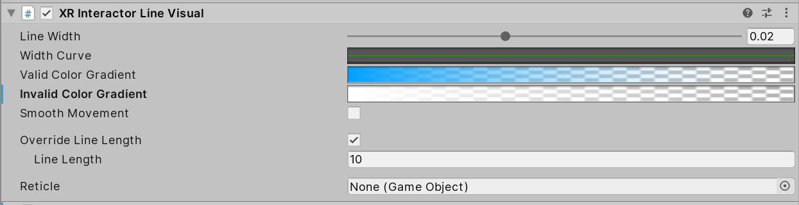

| **Setting** | **Description** |
|-|-|
| **Line Width** | The width of the line, in centimeters. |
| **Width Curve** | The relative width of the line from start to end. |
| **Valid Color Gradient** | When the line hits any collider of a valid target, the line changes to this color gradient. |
| **Invalid Color Gradient** | When there is no valid place to teleport, the line changes to this color gradient. |
| **Reticle** | GameObject to visualize the destination of Teleportation. |
| **Override Line Length** | If you enable this option, the line visual can have a different length from the underlying raycast. |
| **Line Length** | If you enable the **Override Line Length option**, this field controls the visual line length. The visual line length can't be longer than the raycast distance. |
| **Smooth Movement** | If enabled, the rendered line is delayed from and smoothly follows the raycast line. |

## Architecture

The Locomotion System is responsible for managing one XR Rig. The XR Rig handles the user's position in Unity world space. The Locomotion System can restrict access to the XR Rig while Locomotion Providers are moving it. 

For example, at the request of the Teleportation Provider, the Locomotion System locks the XR Rig while in a Teleport action. This ensures that the user can't do another action, such as snap turning or teleporting again, while the current action is active. 

After the Teleport has finished, the Teleportation Provider relinquishes the exclusive lock on the system and allows other Locomotion Providers to influence the XR Rig. 

Locomotion Providers can modify the XR Rig without taking exclusive access if necessary. However, before you give a Locomotion Provider non-exclusive access to the XR Rig, you should always check to see if the Locomotion System is busy before it makes any changes to the XR Rig.

The overall flow of a Locomotion request is as follows:

1. The Locomotion Provider checks to see if the Locomotion System is currently busy.
2. If not, the Locomotion Provider requests exclusive access to the Locomotion System.
3. If the request is successful, the Locomotion Provider moves the XR Rig.
4. When the Locomotion Provider has finished modifying the user's position and/or rotation, the Locomotion Provider relinquishes exclusive access to the Locomotion System.

If the Locomotion System is busy, or the Locomotion Provider is unable to gain exclusive access to the Locomotion System, the Locomotion Provider shouldn't modify the Locomotion System's XR Rig. 

--- 

### XR Rig

The Locomotion System uses the XR Rig as the anchor for the user. 

Before detailing the options on the XR Rig component, it's important to understand the recommended hierarchy of GameObjects to support Interaction.

The image below shows the XR Rig component. 

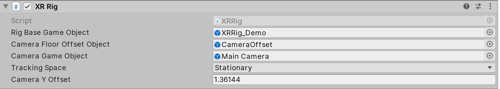

| **Setting** | **Description** |
|-|-|
|**Rig Base Game Object**|Indicates which GameObject acts as the Transform from tracking space into world space. In the recommended hierarchy, this is the "XR Rig" GameObject.|
|**Camera Floor Offset Object**|Sets which GameObject has a vertical offset applied if the device tracking origin doesn't contain the user's height.|
|**Camera Game Object**|Indicates which GameObject holds the user's camera. This is important because the user's camera might not be at the origin of the tracking volume. In the suggested hierarchy, this is the "Camera" GameObject.|
|**Tracking Space**|Sets the desired tracking space used by the application.|
|**Camera Y Offset**| Number of world space units by which the GameObject specified by the **Camera Floor Offset Object** is moved up vertically if the device tracking origin doesn't contain the user's height.|

---

### Locomotion System

The Locomotion System is a MonoBehaviour that acts as the arbitrator for Locomotion Provider access to an XR Rig. 

The following is an image of the Locomotion System MonoBehaviour:

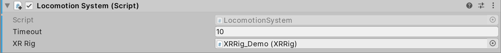

| **Setting** | **Description** |
|-|-|
|**Timeout**|Controls the maximum amount of time a single Locomotion Provider can keep exclusive access of the Locomotion System. In this example, the value is set to 10 seconds.|
|**XR Rig**|Select which XR Rig this Locomotion System will control. You can have as many Locomotion Systems and XR Rigs in your Scene as necessary. By default, it will find the object of type **XR Rig** in the Scene.|

As a best practice, the Locomotion System MonoBehaviour should be located on the XR Rig GameObject. For more information, see the recommended hierarchy setup for interaction.

---

### Locomotion Providers

Locomotion Providers implement different types of locomotion. The XR Interaction package supplies two Locomotion Providers: the Teleportation Locomotion Provider, and the Snap Turn Locomotion Provider. Both implement the `LocomotionProvider` abstract class. 

The `LocomotionProvider` class provides a simple interface to request and relinquish exclusive access to the configured Locomotion System MonoBehaviour. If no `LocomotionSystem` class is configured, the Locomotion Provider attempts to find a Locomotion System MonoBehaviour in the current Scene.

To request exclusive access to the Locomotion System, use the `BeginLocomotion` method. To relinquish access to the Locomotion System, use the `EndLocomotion` method. The implementation of Locomotion Provider must call these methods as appropriate, and relinquish its access when it has finished interacting with the Locomotion System. 

Use the `CanBeginLocomotion` method to check if the Locomotion System is currently in exclusive mode before attempting to call `BeginLocomotion` to acquire it. 

The `LocomotionProvider` abstract class also providers two events:
* **startLocomotion** is invoked on a successful call to `BeginLocomotion`.
* **endLocomotion** is invoked on a successful call to `EndLocomotion`.

The XR Interaction system provides two implementations of a Locomotion Provider: the Teleport Locomotion Provider, and the SnapTurn Locomotion Provider. These are discussed in more detail in the sections below.

---

### Teleportation

The XR Interaction system provides a simple implementation of teleportation that also demonstrates how to implement complex locomotion scenarios using the `LocomotionProvider` and `LocomotionSystem` interfaces.

The Teleportation Provider inherits from the `LocomotionProvider` abstract class. The Teleportation Provider is responsible for moving the XR Rig to the desired location on the user's request.

This implementation has two types of teleportation destinations: an 'Anchor'-based teleportation destination, and an 'Area'-based teleportation destination. These are discussed in more detail below. In short:

- Anchors teleport the user to a pre-determined specific position and/or rotation that they specify.
- Areas allow the player to choose a location on a surface that they wish to teleport to.

Both types of teleportation destinations are implemented on top of the XR Interaction system using the Base Teleportation Interactable as the starting point for shared code.

The XR Interaction system also provides various line rendering options. For more information, see documentation for the [Interaction Package](index.md).

---

#### Teleportation Provider

The Teleportation Provider Component implements the `LocomotionProvider` abstract class. You can have as many instances of the Teleportation Provider Component in your Scene as you need. However, in most cases, a single instance is enough. As a best practice, place this instance under the XR Rig GameObject.

The following image shows the Teleportation Provider MonoBehaviour.

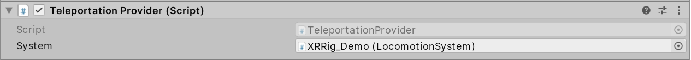

The **System** field should reference the Locomotion System MonoBehaviour that you want the teleportation provider to interact with. If you don't specify a Locomotion System, the provider attempts to find one in the current Scene.

---

#### Teleport Area Interactable

The Teleport Area Interactable is a specialization of the `BaseTeleportInteractable` class. It allows the user to select any location within the teleport anchor as their destination.

The Teleport Area Interactable is intended to be used by the Ray Interactor or any of its specializations. It uses the intersection point of the ray and the area's collision volume to determine the location that the user wants to teleport to. The Teleport Area Interactable has a specialized implementation of the `GenerateTeleportRequest` method, which generates a teleportation request that is queued with the Teleportation Provider.

The following image shows an example of the Teleport Area Interactable:

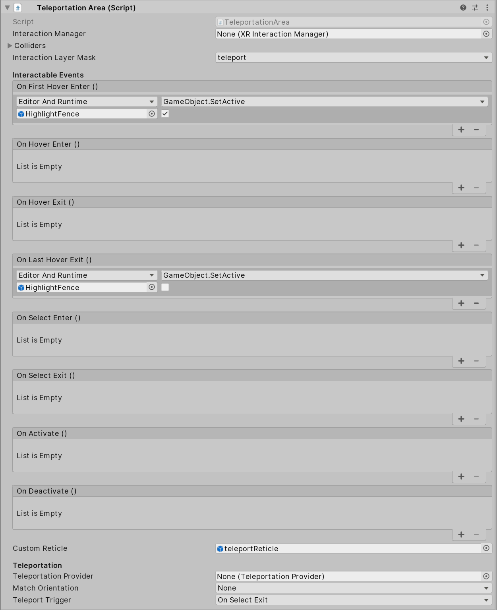

The settings on the Teleportation Area Interactable are similar to other Interactables. The table below only covers the elements that support teleportation.

| **Setting** | **Description** |
|-|-|
|**Teleportation Provider** |Indicates which Teleportation Provider this Interactable communicates with. If a Teleportation Provider is not configured, the Interactable attempts to find a Teleportation Provider in the current Scene.|
|**Teleport Trigger**|Specifies whether the teleportation triggers when the user enters or exits the selection.
|**Match Orientation** |Specifies which object's orientation in the rig will be matched with the destination after teleporting. You can choose from the following options: * **None**: This should be the default option when teleporting on a surface and keeping the orientation consistent. * **Camera**: This option can be useful when using the Teleportation Anchor, if you want to rotate the user and have the camera look at something in the anchor's forward direction. However, this option doesn't move the camera up or down.|

---

#### Teleport Anchor Interactable

The Teleport Anchor is a specialization of the `BaseTeleportInteractable` class that allows the user to teleport to an anchor location by selecting the anchor or an area around it.

The Teleport Anchor Interactable is intended to be used by the Ray Interactor or any of its specializations. It uses the intersection point of the ray and the area's collision volume to determine the location that the user wants to teleport to. The Teleport Anchor Interactable has a specialized implementation of the `GenerateTeleportRequest` method, which generates a teleportation request that is queued with the Teleportation Provider.

The following image shows an example of the Teleport Anchor Interactable.

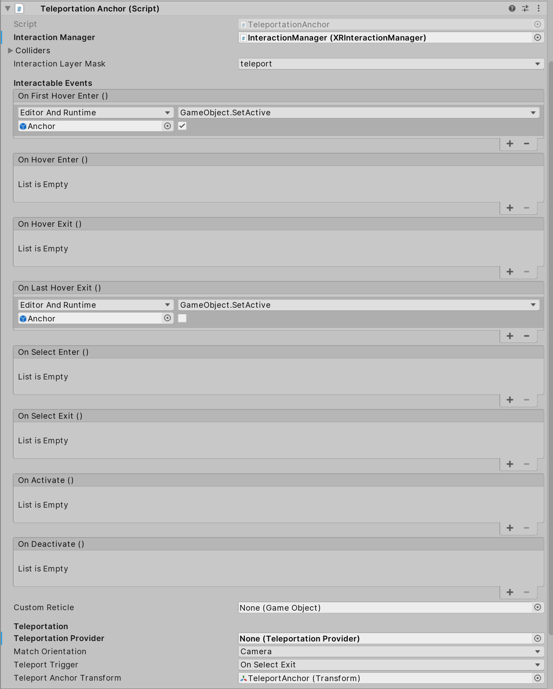

The settings on the **Teleportation Anchor** Interactable are similar to the **Teleport Area** Interactable. This documentation only covers new elements.

The **Teleport Anchor Transform** field defines the transform that the XR Rig teleports to when the user teleports to this anchor. It uses both the position and the rotation of the anchor, depending on which Teleport Type is selected.

---

### Snap Turn

The XR Interaction package provides an example implementation of a Snap Turn Provider. A Snap means the user rotates by a fixed amount when the application receives a configured input (for example, a joystick is moved to the left, or a D-pad is pressed to the right).

The following image shows an example of the Snap Turn Provider.

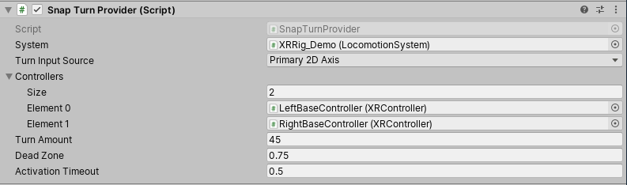

|**Property**|**Description**|
|-|-|
|**Controllers**|Each element in the controllers list is a reference to an XRController that provides device inputs to trigger snap turning|
|**Turn Amount**|Specify by how many degrees the XR Rig will rotate around the Y axis during each snap turn.|
|**Dead Zone**| The controller needs to move more than the amount you specify in this field to be able to trigger a snap turn.|
|**Activation Timeout**|Specify how much time must pass after a successful snap turn before the user can trigger a second snap turn.|

### Document revision history

|Date|Reason|
|---|---|
|January 10, 2020|Documentation fixes, adds reveision history|
